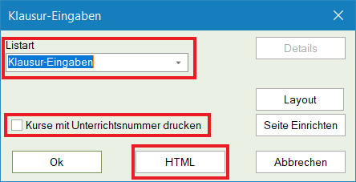

Export starten
==============

GPU-Exporte
###########

Der Export von GPU-Dateien erfolgt über "Datei" > "Import/Export" > "Export TXT Datei (CSV, DIF)".

.. warning:: Beim Export ist wichtig, dass das Trennzeichen und der Zeichensatz in der Konfigurationsdatei korrekt hinterlegt wurden. Anderenfalls kommt es zu Fehlern.

HTML-Exporte
############

Vertretungsplan
***************

Der Vertretungsplan kann über das Infostundenplan-Modul exportiert werden.

Stundenplan
***********

Der Vertretungsplan kann über das Infostundenplan-Modul exportiert werden.

Klausurplan
***********

Leider lässt sich der Klausurplan nicht besonders komfortabel exportieren. Zunächst muss man die Klausuransicht öffnen.
Nun drückt man oben auf das Drucken-Icon oder Strg+P. Es öffnet sich der folgende Dialog, bei dem die Einstellungen
überprüft werden müssen:

.. warning:: Die Listart muss auf "Klausur-Eingaben" gestellt sein und die Option "Kurse mit Unterrichtsnummern drucken" muss deaktiviert werden. Anderenfalls kommt es zu Fehlern.

Im zweiten Schritt muss dann der korrekte Export-Ordner ausgewählt werden:

